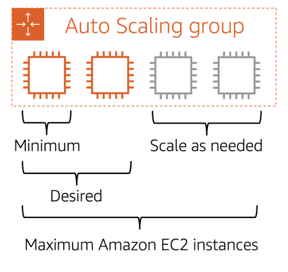
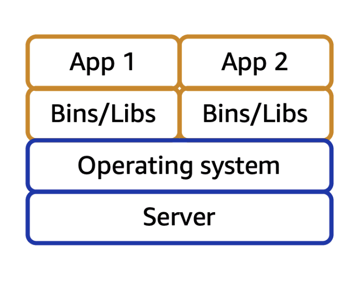

# Amazon Elastic Compute Cloud (EC2)

Amazon EC2, AWS tarafından yönetilen fiziksel sunucular üzerinde sanallaştırma kullanarak, kullanıcıların sanal sunucular (instance'lar) oluşturmasına ve bu kaynakları kendi ihtiyaçlarına göre esnek şekilde kullanmasına olanak tanıyan bir hizmettir.

#### NOT: EC2 kavramındaki "2" elastic compute fikrinin ikinci versiyonu anlamına geliyor. İlk tasarımları çok daha ilkel olduğundan ikinci versiyonu geliştirilmiştir.

Şirketinizin kaynaklarının mimarisinden sorumlu olduğunuzu ve yeni web sitelerini desteklemeniz gerektiğini düşünün. Geleneksel şirket içi kaynaklarla şunları yapmanız gerekir:

- Donanımlar için ön harcama yapmanız gerekir.

- Sunucuların size teslim edilmesini beklemeniz gerekir.

- Sunucuları kendi data center'ınızda kurmanız gerekir.

- Tüm gerekli yapılandırmaları kendiniz yapmalısınız.

Buna karşılık, bir Amazon EC2 instance ile AWS Cloud'da uygulamaları çalıştırmak için sanal bir sunucu kullanırsanız:

- Dakikalar içerisinde bir EC2 instance'ı hazırlayabilir ve başlatabilirsiniz.

- İş yükünüz bittiğinde veya azaldığında kullanmayı bırakabilirsiniz.

- Sadece kullandığınız süre boyunca ödeme yaparsınız.

- Sadece ihtiyacınız olan kaynak kadar ödeme yaparsınız.

## How Amazon EC2 works

EC2 başlatıldığında, hangi OS'in kullanılacağı, application server veya application gibi yapılandırmaları seçersiniz. Ayrıca instance'ınıza özel donanım yapılandırması olan "instance type" da seçersiniz. Ek olarak, instance'nızda trafiği denetlemenize olanak tanıyan güvenlik yapılandırmalarını da belirleyebilirsiniz.

Daha sonrasında instance'a bağlanırsınız. Programlarınızın ve uygulamalarınızın instance'a doğrudan bağlanmak ve veri alışverişinde bulunmak için birden fazla farklı yöntemi vardır. Kullanıcılar ayrıca oturum açarak ve bilgisayarın masaüstüne erişerek instance'a bağlanabilir.

Instance'a bağlandıktan sonra onu kullanmaya başlayabilirsiniz. Yazılım yüklemek, depolama alanı eklemek, dosyaları kopyalamak ve düzenlemek ve daha fazlası için komutlar çalıştırabilirsiniz.

## Amazon EC2 Instance Types

Amazon EC2 instance türleri farklı görevler için optimize edilmiştir. Bir instance türü seçerken, iş yüklerinizin ve uygulamalarınızın özel ihtiyaçlarını göz önünde bulundurursunuz. Bu, compute, memory veya storage gibi yetenekler için gereksinimleri içerebilir.

### General Purpose Instances

Genel amaçlı instance'lar, hesaplama (compute), bellek ve ağ kaynakları arasında bir denge sağlar. Bunları çeşitli iş yükleri için kullanabilirsiniz, örneğin:

- uygulama sunucuları

- oyun sunucuları

- kurumsal uygulamalar için backend sunucuları

- küçük ve orta ölçekli veritabanları

Eğer uygulamalarınız herhangi bir kaynağın spesifik olarak optimize edilmesini gerektirmiyorsa, tüm kaynakları dengeli bir şekilde kullanabilirsiniz. Genel amaç için instance'lar tam olarak bunun içindir.

### Compute Optimized Instances

Compute optimized instances, çok yoğun işlem gücü isteyen işler için özel olarak tasarlanmış EC2 instance türleridir. Yani CPU performansının çok kritik olduğu işler için idealdirler. Normal işler için general purpose kullanılırken, işlemciyi çok fazla kullanan işler için compute optimized tercih edilir. 

- High-Performance Web Servers (Çok fazla kullanıcıya hızlı cevap vermesi gereken web siteleri)

- Compute-Intensive Application Servers (Çok ağır matematiksel hesaplama yapan backend sunucular)

- Dedicated Gaming Servers (FPS oyun sunucuları gibi sürekli CPU kullanan şeyler)

- Batch Processing (Bir anda milyonlarca işlemi toplu şekilde işlemek: büyük veri analizleri, finansal işlemler vs.)

### Memory Optimized Instances

Eğer uygulama çok fazla RAM kullanıyorsa, yani hafızaya aşırı yükleniyorsa, o zaman memory optimized (bellek optimize edilmiş) EC2 instance kullanılmalıdır. Çünkü bu instance'lar normalden çok daha fazla RAM verir. Böylece büyük veriler, gerçek zamanlı işlemler, yüksek performanslı veritabanları rahatça çalışır.

- High-Performance Databases (RAM içinde çalışan dev veritabanları – örneğin SAP HANA gibi.)

- Real-time Big Data İşlemleri (Mesela canlı canlı milyonlarca kullanıcıdan veri akıyor ve bunu anında analiz ediyorsun.)

### Accelerated Computing Instances

Accelerated computing instance'lar, bazı işlemleri CPU üzerinde yazılım çalıştırarak yapmaktan daha verimli şekilde gerçekleştirebilmek için donanım hızlandırıcıları veya yardımcı işlemciler (coprocessorlar) kullanır.

Bu işlemlere örnek olarak ondalıklı sayı (floating-point) hesaplamaları, grafik işleme ve veri desen eşleştirme verilebilir.

Bilgisayar biliminde, bir donanım hızlandırıcı, veri işleme sürecini hızlandırabilen bir bileşendir.

Accelerated computing instance'lar, grafik uygulamaları, oyun akışı (game streaming) ve uygulama akışı (application streaming) gibi iş yükleri için idealdir.

Özet olarak, bilgisayarda her işlemi CPU yapsa da yüksek çözünürlüklü grafik işleme, video encode/decode gibi işlemler için yetersiz kalabilir. Bu noktada "Hardware Accelerator" yani donanım hızlandırıcılar devreye giriyor. AWS de Accelerated Computing Instances ile donanımlarda CPU'ya ek olarak NVIDIA Tesla gibi GPU'lar veya özel hızlandırıcılar sağlıyor.

Örneğin Netflix, AWS’de NVIDIA T4 GPU’ları kullanan G4 instance ailesiyle çalışıyor. Veya Nvidia GeForce Now, tamamen accelerated computing üzerine kurulu: her kullanıcı için bir oyun çalıştırılıyor ve canlı canlı stream ediliyor.

#### NOT: Bu noktada CPU ve GPU farkını anlamak önemlidir. CPU, az işlem için ama çok akıllıca davranan yani değişken işler için tasarlanmıştır. Yani görece az ama kompleks işler için kullanılır. Bununla beraber grafik, aşırı miktarda küçük, birbirine çok benzeyen işlemlerdir. Dolayısıyla da GPU'lar daha basit ama çok sayıda işlemler için kullanılır. Örneğin, bir video işlemeye çalıştınığınızı varsayalım. Bir video demek milyonlarca piksel ve çok sayıda renk demektir. CPU bu kadar fazla işlemi teknik olarak işlerken çok zorlanacaktır. Bunun yerine GPU bunun gibi işler için birebirdir. CPU ise daha akıllı davranır ve mantık gerektiren değişken işlemler için idealdir.

### Storage Optimized Instances

Eğer uygulama sürekli olarak çok veri okuyorsa ve yazıyorsa, yani veri trafiği aşırı fazlaysa, Storage Optimized Instances kullanılması gerekir.

IOPS (Input/Output Operations Per Second), bir disk ya da storage cihazının 1 saniyede kaç tane veri girdi/çıktı işlemi yapabildiğini gösteren bir performans ölçüsüdür.  Storage Optimized Instances, çok yüksek IOPS ile beraber düşük latency sağlar.

## Amazon EC2 Pricing

Amazon EC2 ile yalnızca kullandığınız işlem süresi için ödeme yaparsınız. Amazon EC2, farklı kullanım durumları için çeşitli fiyatlandırma seçenekleri sunar. Bunlar 5 kategoriye ayrılır:

### On-demand Instances

On-Demand Instance'lar, kesintiye uğratılamayan, kısa süreli ve düzensiz iş yükleri için idealdir. 

Ön ödeme gerektirmez ve minimum sözleşme şartı yoktur. Instance'lar, siz durdurana kadar kesintisiz olarak çalışır ve yalnızca kullandığınız işlem süresi için ödeme yaparsınız. On-Demand Instance'ların örnek kullanım senaryoları arasında, uygulama geliştirme ve test etme ile usage pattern'ları öngörülemeyen uygulamaları çalıştırmak bulunur.

On-Demand Instance'lar, bir yıl veya daha uzun süre devam edecek iş yükleri için önerilmez.
Çünkü bu tür uzun süreli iş yükleri, Reserved Instance kullanarak daha fazla maliyet tasarrufu sağlayabilir.

### Reserved Instance

Reserved Instance'lar, hesabınızdaki On-Demand Instance kullanımı üzerine uygulanan bir faturalandırma indirimi türüdür.

İki tür Reserved Instance bulunmaktadır:

- Standard Reserved Instances

- Convertible Reserved Instances

Standard Reserved ve Convertible Reserved Instance'ları 1 yıllık veya 3 yıllık süreler için satın alabilirsiniz.
3 yıllık seçenekle daha büyük maliyet tasarrufu sağlarsınız.

| Özellik                       | Standard Reserved Instance                          | Convertible Reserved Instance                       |
|--------------------------------|-----------------------------------------------------|-----------------------------------------------------|
| İndirim Oranı                  | Daha yüksek (maksimum indirim)                      | Biraz daha düşük indirim oranı                       |
| Esneklik (Instance Değişimi)   | Yok (instance tipi, platform, bölge sabit kalır)    | Var (instance tipi, platform ve bölge değiştirilebilir) |
| Süre Opsiyonu                  | 1 yıl veya 3 yıl                                    | 1 yıl veya 3 yıl                                    |
| Kullanım Senaryosu             | Sabit, uzun süreli ihtiyaçlar için (değişmeyecek iş yükü) | İş yükü zamanla değişebilecek sistemler için         |
| Capacity Reservation (Kapasite Garantisi) | İstersen belirli Availability Zone için rezervasyon yapabilirsin (Daha önceden hiç rezervasyon yapılmadıysa) | İstersen belirli Availability Zone için rezervasyon yapabilirsin (Daha önceden rezervasyon yapılmış olsa bile mevcut olan değiştirilebilir.) |
| En Uygun Kullanım Durumu       | 7/24 çalışan, sabit bir uygulama                    | Gelecekte instance türü değiştirme ihtimali olan uygulamalar |

> Platform = Operating System

> Availability Zone = AWS'nin bir bölgede (region'da) bulunan birbirinden bağımsız, fiziksel veri merkezleri topluluğudur. Başka bir deyişle, Aynı şehirde (veya yakın bir alanda) bulunan, birbirinden ayrı veri merkezleri. Birbirinden elektrik, internet, bina, altyapı olarak ayrıdırlar. Ama aralarında çok hızlı ve güvenli bağlantılar vardır.

Sonuç olarak, *Standart Reserved Instances* seçeneği, steady-state (kararlı) uygulamalarınız için ihtiyaç duyduğunuz EC2 instance türü ve boyutu ile bunları hangi AWS Bölgesinde (region) çalıştırmayı planladığınızı biliyorsanız seçilmelidir.

Reserved Instances için şunları belirtmeniz gerekir:

- Instance type and size: Örneğin, m5.xlarge

- Platform description (operating system): Microsoft Windows Server or Red Hat Enterprise Linux vs.

- Tenancy: Default tenancy veya dedicated tenancy seçilebilir. Default tenancy, başkalarıyla aynı fiziksel makinede paylaşım yapılmasıyken dedicated tenancy sana özel makine atanmasıdır.

EC2 Reserved instance'larınız için bir "Availability Zone" belirtme seçeneğiniz vardır. Belirtirseniz, EC2 capacity reservation elde edersiniz. Bu, istediğiniz miktarda EC2 instance'ının ihtiyaç duyduğunuzda kullanılabilir olmasını sağlar.

EC2 instance'larınızı farklı Availability Zone veya farklı instance türlerinde çalıştırmanız gerekiyorsa, "*Convertible Reserved Instances*" sizin için doğru seçim olabilir. 

Not: EC2 instance'ları çalıştırmak için esnekliğe ihtiyaç duyduğunuzda daha az bir indirimden yararlanırsınız. Ne kadar değişiklik o kadar maliyet diyebiliriz.

Reserved Instance anlaşmanızın sonuna geldiğinizde, hiçbir kesinti olmadan EC2 instance'ınızı kullanmaya devam edebilirsiniz. Ancak, aşağıdakileri yapmadığınız sürece on-demand oranlarına göre ödeme yapmanız gerekir:

- Instance'ınızı sonlandırmak

- Eski instance özellikleriniz ile eşleşen yeni bir reserved instance almak. (instance family ile size, Region, platform, ve tenancy)

### EC2 Instance Saving Plans

AWS, Amazon EC2 dahil olmak üzere birkaç compute hizmeti için Savings Plans (Tasarruf Planları) sunar.

EC2 Instance Savings Plans, belirli bir EC2 instance ailesi ve Bölge için 1 yıllık veya 3 yıllık bir süre boyunca saatlik harcama taahhüdü verdiğinizde EC2 instance maliyetlerinizi azaltır. Bu süre taahhüdü, On-Demand fiyatlarına kıyasla %72'ye varan tasarruf sağlar.

Yapılan taahhüt miktarına kadar olan tüm kullanım, indirimli Savings Plans fiyatı üzerinden ücretlendirilir (örneğin, saatte 10 USD). Taahhüdün üzerindeki kullanım ise normal On-Demand fiyatlarıyla ücretlendirilir.

EC2 Instance Savings Plans, taahhüt süresi boyunca Amazon EC2 kullanımınızda esneklik istiyorsanız iyi bir seçenektir.

Seçtiğiniz bir Bölge içindeki herhangi bir EC2 instance ailesi kullanımı üzerinde (örneğin, Kuzey Virginia bölgesindeki M5 kullanımı) tasarruf edersiniz. Bu tasarruf, Availability Zone, instance boyutu, işletim sistemi veya tenancy fark etmeksizin geçerlidir. 

EC2 Instance Savings Plans ile elde edilen tasarruf, Standard Reserved Instances ile sağlanan tasarrufa benzer seviyededir.

Ancak, Reserved Instance'lardan farklı olarak,

➔ İndirim almak için önceden belirli bir EC2 instance türü ve boyutu (örneğin, m5.xlarge), işletim sistemi ve tenancy belirtmeniz gerekmez.

➔ Ayrıca, 1 yıllık veya 3 yıllık bir süre boyunca belirli bir EC2 instance sayısına taahhütte bulunmanız da gerekmez.

➔ Buna ek olarak, EC2 Instance Savings Plans, bir EC2 kapasite rezervasyonu seçeneği de sunmaz.

AWS Cost Explorer (ileride detaylı inceleyeceğiz) ile AWS maliyetlerinizi ve kullanımınızı zaman içinde görselleştirerek anlayabilir ve yönetebilirsiniz.

Savings Plans seçeneklerini değerlendirirken, AWS Cost Explorer’ı kullanarak son 7, 30 veya 60 gün içerisindeki Amazon EC2 kullanımınızı analiz edebilirsiniz.

AWS Cost Explorer ayrıca, Amazon EC2 maliyetlerinizde ne kadar tasarruf edebileceğinizi tahmin eden özelleştirilmiş Savings Plans önerileri de sağlar. Bu öneriler, geçmiş Amazon EC2 kullanımınıza ve 1 yıllık veya 3 yıllık Savings Plan'larda saatlik taahhüt miktarınıza dayanarak yapılır.

### Spot Instances

Spot Instance'lar, başlangıç ve bitiş zamanlarında esneklik olan veya kesintilere dayanabilecek iş yükleri için idealdir.

Spot Instance'lar, Amazon EC2'nin kullanılmayan bilişim kapasitesini kullanır ve On-Demand fiyatlarına kıyasla %90'a varan maliyet tasarrufu sağlar.

Diyelim ki, gerektiğinde başlayıp durdurulabilen bir arka plan işleme göreviniz var (örneğin, bir müşteri anketi için veri işleme işi). Bu işleme görevini başlatıp durdurmak istiyorsunuz ve bu süreç şirketinizin genel operasyonlarını etkilemeyecek.

Eğer bir Spot isteği oluşturursanız ve Amazon EC2 kapasitesi mevcutsa, Spot Instance'ınız başlatılır.
Ancak, bir Spot isteği oluşturduğunuzda Amazon EC2 kapasitesi mevcut değilse, istek başarılı olmaz ve kapasite uygun hale gelene kadar beklemeniz gerekir. Kullanılamayan kapasite, arka plan işleme görevinizin başlamasını geciktirebilir.

Bir Spot Instance başlattıktan sonra, eğer kapasite artık mevcut değilse veya Spot Instance talebi artarsa, instance'ınız kesintiye uğrayabilir. Bu durum, arka plan işleme göreviniz için bir sorun teşkil etmeyebilir.

Ancak, örneğin uygulama geliştirme ve test etme gibi işlerde, beklenmedik kesintilerden kaçınmak istersiniz.
Bu nedenle, bu tür görevler için ideal olan farklı bir EC2 instance türü seçmeniz daha iyi olur.

Aslında Spot Instance özetle, size o anda kullanılmayan EC2 kapasitesini süper ucuza sağlar ama istediğiniz zaman başlatılamayabilir veya çalışırken kapatılabilir.

### Dedicated Hosts

Dedicated Host'lar, Amazon EC2 instance kapasitesi bulunan ve tamamen sizin kullanımınıza ayrılmış fiziksel sunuculardır. Mevcut soket başına, çekirdek başına veya sanal makine başına lisanslarınızı kullanarak lisans uyumluluğunuzu korumanıza yardımcı olabilirsiniz. On-Demand Dedicated Host satın alabilir veya Dedicated Host Reservation yapabilirsiniz.

Burada bahsedilen tüm Amazon EC2 seçenekleri arasında, Dedicated Host'lar en pahalı olan seçenektir.

## Scaling Amazon EC2

Ölçeklenebilirlik (Scalability), bir sistemin artan iş yükü karşısında kapasitesini arttırabilme yeteneğidir.

Yani: Talep artarsa, sistem buna cevap verecek şekilde büyüyebilmeli. Talep azalırsa, sistem gereksiz kaynakları bırakabilmeli.

Auto Scability ise, yalnızca ihtiyaç duyduğun kaynaklarla başlamak ve mimarini, değişen talebe otomatik olarak yanıt verecek şekilde dışa (scale out) veya içe (scale in) doğru ölçeklenecek şekilde tasarlamaktır. 

Bu sayede, yalnızca kullandığın kaynaklar için ödeme yaparsın. Müşterilerinin ihtiyaçlarını karşılayacak bilişim kapasitesinin yetersiz kalmasından endişelenmene gerek yoktur.

Bunu sağlayan AWS hizmeti, Amazon EC2 Auto Scaling’dir

### Amazon EC2 Auto Scaling

Daha önce erişmeye çalıştığın bir web sitesi hiç yüklenmediyse ya da sık sık zaman aşımına uğradıysa, bu büyük ihtimalle sitenin kaldırabileceğinden fazla istek alması yüzündendir. Bu durum, bir kahve dükkânında sadece bir baristanın çalıştığı ve müşterilerin uzun kuyruklar oluşturduğu bir senaryoya benzer.

Amazon EC2 Auto Scaling, uygulamanın talebe göre değişen ihtiyaçlarına yanıt olarak, EC2 instance’larını otomatik olarak eklemeni (scale out) veya azaltmanı (scale in) sağlar.

Bu sayede, instance sayısı gerektiğinde otomatik olarak artırılıp azaltılarak uygulamanın yüksek erişilebilirliği korunur ve gereksiz kapasitenin de önüne geçilir.

Amazon EC2 Auto Scaling içinde iki farklı yaklaşım bulunur:

- Dinamik Ölçekleme (Dynamic Scaling) → Uygulama talebindeki değişikliklere gerçek zamanlı tepki verir.

- Tahmine Dayalı Ölçekleme (Predictive Scaling) → Geçmiş verilere dayanarak gelecekteki talebi tahmin eder ve instance sayısını önceden ayarlayarak buna göre zamanlama yapar.

Daha hızlı scale olmak isterseniz hem dynamic hem de predictive scaling'i birlikte kullanmanız gerekir.

#### Scale up: Daha güçlü makineler kullanmak anlamına gelir (daha büyük instance).

#### Scale out: Daha çok sayıda makine kullanmak demektir (yatay ölçekleme).

Örneğin, bir markette kasiyerin boyutunu büyültmek (scale up), artan müşteri talebi için bir çözüm değildir. Ama birden fazla kasiyer koymak yani scale out yapmak bir çözümdür.

> Decoupling: Tanım olarak, sistem parçalarını ayırmak demektir. Bu da sonuç olarak her bir kaynağın ayrı ayrı ölçeklenmesini, güncellenmesini ve yönetilmesine olanak tanır. Bu noktada ölçeklemeden bahsettiğimiz için, onun üstünden gidecek olursak;

> Bir yerde yoğunluk varsa sadece o parçayı büyütürsün. Örneğin, bir kahve dükkanında çalışanlar olarak kasiyer ve baristanın olduğunu varsayalım. Baristalar müşteri talebini karşılıyor ama kasiyerler karşılayamıyorsa, sadece kasiyerlerin sayısını arttırırsınız.

#### Örnek: Amazon EC2 Auto Scaling

Bulutta, bilgi işlem gücü programlanabilir bir kaynak olduğundan, ölçekleme konusunda daha esnek bir yaklaşım benimseyebilirsin. Bir uygulamaya Amazon EC2 Auto Scaling ekleyerek, gerektiğinde yeni EC2 instance'ları ekleyebilir ve ihtiyaç kalmadığında bunları sonlandırabilirsin. Bir Auto Scaling grubu oluşturduğunda, minimum Amazon EC2 instance sayısını belirleyebilirsin. Minimum kapasite, Auto Scaling grubunu oluşturduktan hemen sonra başlatılacak EC2 instance sayısını ifade eder. Bu örnekte, Auto Scaling grubunun minimum kapasitesi bir EC2 instance’dır.

Sonrasında, uygulamanın çalışması için minimum bir EC2 instance yeterli olsa bile, istenen kapasiteyi (desired capacity) iki EC2 instance olarak ayarlayabilirsin.

Diyelim ki bir uygulamayı Amazon EC2 instance’larında başlatmaya hazırlanıyorsun. Auto Scaling grubunun boyutunu yapılandırırken minimum EC2 instance sayısını bire ayarlayabilirsin. Bu, her zaman en az bir EC2 instance’ın çalışıyor olması gerektiği anlamına gelir.

Eğer bir auto scaling grubunda, desired capacity ayarlanmazsa, default olarak minimum instance kadar çalışacaktır.

Auto Scaling grubunda ayarlayabileceğin üçüncü yapılandırma ise maksimum kapasitedir. Örneğin, artan talebe yanıt olarak ölçekleme yapılmasını isteyebilirsin; ancak bu ölçeklemenin en fazla dört Amazon EC2 instance’a kadar çıkmasına izin verebilirsin.

Amazon EC2 Auto Scaling, Amazon EC2 instance’larını kullandığı için yalnızca kullandığın süre boyunca ve kullandığın kadar ödeme yaparsın. Bu sayede, maliyetleri azaltırken en iyi müşteri deneyimini sağlayan maliyet açısından verimli bir mimariye sahip olursun. Ya da istersen diğer instance türleri ile de kullanabilirsin (spot, reserved vs.).

-------------------------------------------------------------------------------------------------------------------------------

## Elastic Load Balancing (ELB)

Elastic Load Balancing, AWS'in gelen uygulama trafiğini birden fazla kaynak arasında (örneğin Amazon EC2 instance'ları gibi) otomatik olarak dağıtan servisidir.

Bir yük dengeleyici (load balancer), Auto Scaling grubuna gelen tüm web trafiği için tek bir temas noktası (single point) gibi davranır. Bu da demek oluyor ki, gelen trafik miktarına bağlı olarak Amazon EC2 instance'ları eklediğinde veya kaldırdığında, istekler önce load balancer'a gider. Ardından bu istekler, onları işleyecek birden fazla kaynağa dağıtılır. Yani, yeni bir EC2 instance eklenince, Auto Scaling otomatik olarak ELB'ye "bu instance trafik alabilir" diye haber verir. Aynı şekilde kapanırken de haber verir.

Örneğin birden fazla Amazon EC2 instance’ın varsa, Elastic Load Balancing bu iş yükünü tüm instance’lar arasında dağıtır, böylece hiçbir instance işin büyük bir kısmını tek başına taşımak zorunda kalmaz.

Elastic Load Balancing ve Amazon EC2 Auto Scaling ayrı servisler olmasına rağmen, birlikte çalışarak Amazon EC2 üzerinde çalışan uygulamaların yüksek performans ve yüksek erişilebilirlik sunmasını sağlarlar. Dolayısıyla da ELB otomatik ölçeklenebilir. 

Dediğimiz gibi, trafik artsa da ELB kendi kendine ölçeklenir, senin müdahale etmene veya ekstra para ödemen gerekmez (sabit saatlik ücret içinde).

### Örnek: Elastic Load Balancing

> Low-demand period

> Elastic Load Balancing’in nasıl çalıştığına bir örnek verelim. Diyelim ki birkaç müşteri kahve dükkanına geldi ve sipariş vermeye hazır.

> Eğer sadece birkaç kasa açıksa, bu durum hizmet almak isteyen müşteri talebiyle uyumludur. Kahve dükkanında, müşterisiz açık duran kasaların olması daha az olasıdır. Bu örnekte, kasaları Amazon EC2 instance’ları gibi düşünebilirsin.

> High-demand period

> Gün boyunca müşteri sayısı arttıkça, kahve dükkanı daha fazla kasayı açarak müşterileri karşılar.

> Ayrıca, bir kahve dükkanı çalışanı müşterileri en uygun kasaya yönlendirir, böylece istekler açık olan kasalar arasında eşit şekilde dağılır. Bu kahve dükkanı çalışanını, bir yük dengeleyici (load balancer) olarak düşünebilirsin.

Yani özet olarak, kullanılmayan instance'lar kapatılır, talep arttığında ise instance'lar tekrar devreye girer.

#### EK OLARAK BİLGİLER:

- İstersen kendi load balancer'ını kurup (third-party veya custom) yönetebilirsin (kurulum, güncelleme, ölçekleme, failover yönetimi sana kalıyor).

- Elastic Load Balancing (ELB) Bölgesel (Regional) Bir Servistir. ELB, EC2 instance'lar gibi tek bir fiziksel instance üstünde çalışmaz, bölgesel olarak (Region seviyesinde) çalışır. Bu yüzden yüksek erişilebilirlik (High Availability) kendiliğinden gelir.

- ELB sadece dışarıdan gelen trafik için değil, frontend → backend trafiği için de kullanılabilir. Frontend'ler backend instance sayısını bilmek zorunda kalmaz, sadece ELB URL'ine istek atar. Bu da frontend ve backend'i birbirinden ayırarak "Decoupled Architecture" sunar.

-------------------------------------------------------------------------------------------------------------------------------

## Messaging and Queuing

Eğer uygulamalar birbiriyle doğrudan -buffer olmadan- iletişim kuruyorsa, bu "tightly coupled" (sıkı bağlı) bir mimaridir. Örneğin A uygulaması ile B uygulaması birbiri ile direk olarak iletişime geçiyor olsun. B uygulamasında bir sorun çıkarsa otomatik olarak A uygulaması da hata verecektir. Tightly coupled mimarilerde, bir bileşenin arızalanması tüm sistemin arızalanmasına yol açar.

Bunun yerine daha sağlam ve esnek bir yapı olan "loosely coupled" (gevşek bağlı) mimari kullanılır. Bu mimaride bir bileşen çökerse diğerleri etkilenmez, sistem ayakta kalır. Bunu, A uygulamasından B uygulamasına mesajın gitmeden evvel ilk olarak bir buffer'dan geçmesini sağlayarak yapar. B uygulamasında bir hata oluşursa mesaj, buffer'da kuyrukta (queue) bekler. B uygulaması ne zaman düzelirse mesaj o zaman gönderilir.

AWS mimarilerinde de hedef budur: loosely coupled sistemler kurmak. Bu noktada iki önemli AWS hizmeti devreye girer:

Amazon SQS (Simple Queue Service) ve Amazon SNS (Simple Notification Service).

### Amazon SQS

SQS, yazılım bileşenleri arasında mesajları güvenli bir şekilde gönderip almanı, saklamanı ve kuyrukta tutmanı sağlar. Mesaj içerisindeki veriler payload olarak adlandırılır ve güvenli bir şekilde saklanır. Mesajlar kuyrukta bekler ve uygulama kullanılabilir olduğunda mesajı işler.

SQS altyapısı otomatik olarak ölçeklenir (auto scaling), güvenilirdir, kurulumu kolaydır. AWS senin için barındırır.

### Amazon SNS

SNS de mesaj göndermeni sağlar ama bu sefer bildirim tarzında çalışır. 

“Publish/Subscribe” modelini kullanır. Yani bir SNS konusu (topic) oluşturursun. Bunu bir kanal gibi düşünebilirsiniz. Sonra bu kanala abone olacak hedefleri eklersin. Ve bir mesaj yayınladığında, o mesaj tüm abonelere aynı anda gider. Bu aboneler; bir SQS kuyruğu, bir Lambda fonksiyonu ya da HTTP/HTTPS webhook olabilir. Ayrıca SNS, kullanıcılara SMS, e-posta veya mobil bildirim de gönderebilir. 

Kısaca SNS, farklı sistemlere aynı anda mesaj göndermek için kullanılır. SNS, aynı mesajı birçok yere aynı anda dağıtır. SQS gibi sıraya koymaz, bekletmez, direkt dağıtır.

#### NOT: Bir topic ile ilgili bir mesaj yayınlandığında, sadece o topic'e abone olan sistemler o mesajı alır.

#### NOT: Ve tekrar söylemek gerekirse, bu mesajı alan kişiler sadece insanlar olmak zorunda değildir. Aynı zamanda sistemler ve servisler de olabilirler.

### Monolithic Applications and Microservices

Uygulamalar, birden çok bileşenden oluşur. Bu bileşenler, verileri iletmek, istekleri karşılamak ve uygulamanın çalışmasını sürdürmek için birbirleriyle iletişim kurar.

Diyelim ki birbirine sıkı sıkıya bağlı bileşenlere sahip bir uygulamanız var. Bu bileşenler; veritabanları, sunucular, kullanıcı arayüzü, iş mantığı gibi şeyleri içerebilir. Bu tür bir mimari, "monolithic" bir uygulama olarak kabul edilebilir.

Bu uygulama mimarisi yaklaşımında, eğer tek bir bileşen arızalanırsa diğer bileşenler de arızalanır ve muhtemelen tüm uygulama çöker.

*Uygulamanın kullanılabilirliğini, tek bir bileşen arızalandığında bile sürdürebilmek için, uygulamanızı mikro hizmetler yani "microservices" yaklaşımıyla tasarlayabilirsiniz.*

Mikro hizmetler yaklaşımında, uygulama bileşenleri gevşek bağlıdır (loosely coupled). Bu durumda, eğer bir bileşen arızalanırsa diğer bileşenler çalışmaya devam eder çünkü birbirleriyle bağımsız bir şekilde iletişim kurarlar. Bu gevşek bağlı yapı, tüm uygulamanın çökmesini engeller.

AWS üzerinde uygulama tasarlarken, farklı işlevleri yerine getiren servisler ve bileşenlerle mikro hizmetler yaklaşımını kullanabilirsiniz.
Bu uygulama entegrasyonunu kolaylaştıran iki hizmet daha önceden de bahsettiğimiz gibi; Amazon Simple Notification Service (Amazon SNS) ve Amazon Simple Queue Service (Amazon SQS)'dir.

-------------------------------------------------------------------------------------------------------------------------------

## Additional Compute Services

### Serverless Computing Mantığı

Önceki konularda, bulutta sanal sunucular çalıştırmanıza olanak tanıyan bir hizmet olan Amazon EC2’yi öğrendik. Amazon EC2 üzerinde çalıştırmak istediğiniz uygulamalar varsa, aşağıdaki adımları gerçekleştirmeniz gerekir:

- Instance’ları (sanal sunucuları) sağla (provision et).

- Kodunu yükle

- Uygulaman çalışırken bu instance’ları yönetmeye devam et.

Bunun haricinde, “Serverless” (sunucusuz) terimi ise, kodunuzun yine sunucular üzerinde çalıştığı ancak bu sunucuları sağlamak (provision) veya yönetmek zorunda olmadığınız anlamına gelir.

Serverless computing sayesinde, sunucu bakımıyla uğraşmak yerine yeni ürünler ve özellikler geliştirmeye odaklanabilirsiniz.

Serverless computing'in bir diğer avantajı ise, uygulamaların otomatik olarak ölçeklenebilmesidir. Serverless mimari, uygulamanın kapasitesini; bellek (memory) ve veri işleme hızı (throughput) gibi tüketim birimlerine göre otomatik olarak ayarlayabilir.

AWS’nin serverless computing için sunduğu hizmetlerden biri AWS Lambda’dır.

## AWS Lambda

AWS Lambda, sunucuları sağlamak veya yönetmek zorunda kalmadan kod çalıştırmanıza olanak tanıyan bir hizmettir. 

AWS Lambda kullanırken, yalnızca kullandığınız işlem süresi kadar ödeme yaparsınız. Yani, kodunuz çalıştığı sürece ücretlendirilirsiniz; çalışmadığı zaman herhangi bir ücret ödemezsiniz.

Ayrıca, sıfır sunucu yönetimiyle bile her türlü uygulama veya arka uç (backend) servisi için kod çalıştırabilirsiniz. Örneğin, basit bir Lambda fonksiyonu; AWS Cloud’a yüklenen görsellerin otomatik olarak yeniden boyutlandırılmasını içerebilir.
Bu durumda, fonksiyon yeni bir görsel yüklendiğinde tetiklenir (trigger edilir).

### How AWS Lambda works?

1- Kodunu yüklersiniz.

2- Kodunuzu, AWS servisleri, mobil uygulamalar veya HTTP uç noktaları (endpoints) gibi bir olay kaynağından (event source) tetiklenecek şekilde ayarlarsınız.

3- Lambda, kodunuzu sadece tetiklendiğinde çalıştırır.

4- Yalnızca kullandığınız işlem süresi kadar ödeme yaparsınız. Önceki görsel yeniden boyutlandırma örneğinde olduğu gibi, yalnızca yeni görseller yüklendiğinde Lambda çalışır ve siz de sadece bu işlem süresi için ödeme yaparsınız. Görsel yükleme olayı (event), Lambda fonksiyonunun tetiklenmesine neden olur.

*AWS'de ayrıca, containerized uygulamalar da oluşturabilir ve çalıştırabilirsiniz.*

## Containers

Container’lar, uygulamanızın kodunu ve bağımlılıklarını tek bir nesne (object) içinde paketlemenin standart bir yolunu sunar.

Ayrıca container’lar; güvenlik, güvenilirlik (reliabilty) ve ölçeklenebilirlik gibi temel gereksinimlerin bulunduğu süreçler ve iş akışları için de kullanılabilir. Yani, container'lar sadece kodları paketlemekten ibaret değildir. Aynı zamanda, eğer bir iş süreci veya uygulama;

- Güvenli olmalıysa (izole çalışmalı, dışarıya kapalı olmalıysa),

- Güvenilir olmalıysa (kolay çökmesin, tutarlı çalışsın),

- Kolay ölçeklenebilir olmalıysa (yük artınca aynı container’dan çoğaltabilirsin),

o zaman, container mimarisi kullanılabilir.

*Bunları daha iyi anlayabilmek için container'ın çalışma mantığını oturtmamız gerekir.*

### How containers work?

> One host with multiple containers

Bir yazılımcının kendi bilgisayarında uygulama geliştirdiğini varsayalım. Uygulama kendi bilgisayarında sorunsuz çalışıyor. Ama aynı uygulama, IT ekibinin sunucusuna veya başka bir ortama kurulduğunda, hata veriyor ve farklı davranıyor. Bunun nedeni, uygulamanın çalıştırıldığı ortamın, geliştirildiği ortamdan farklı olmasıdır. Örneğin, yazılmcı bilgisayarında başka bir python sürümünü kullanıyorsa, sunucuda ise daha farklı bir kütüphane versiyonu mevcutsa, uygulama hata verebilir. Bunun çözümü ise container'lardan geçer.

Yazılımcı uygulamayı bir container içine koyar, yani; kodu, kütüphaneleri, ayarları ve kullandığı işletim sistemi gibi öğeleri bir pakette topluyor. Ve sonuç olarak o container, her ortamda çalışır hale geliyor çünkü, "Aynı container = Aynı ortam, aynı sonuç".

Bu yöntem, uygulamalardaki hataları ayıklamak (debug) ve bilgisayar ortamları arasındaki farkları teşhis etmek için harcanan zamanı azaltmaya yardımcı olur.

> Tens of hosts with hundreds of containers

Container tabanlı uygulamalar çalıştırırken, ölçeklenebilirlik konusunu dikkate almak önemlidir.

Diyelim ki artık sadece tek bir host üzerinde birkaç container değil de:

Onlarca host üzerinde yüzlerce container, hatta yüzlerce host üzerinde binlerce container yönetmen gerekiyor.

Bu kadar büyük ölçekte bir ortamda; bellek kullanımı, güvenlik, loglama gibi şeyleri tek tek elle takip etmek ne kadar zaman alır? bir hayal edin.

İşte tam da bu soruna çözüm olarak, container orchestration servisleri, container tabanlı uygulamalarınızı dağıtmanıza (deploy), yönetmenize ve ölçeklendirmenize yardımcı olur. container orkestrasyonu sağlayan iki hizmet; Amazon Elastic Container Service (Amazon ECS) ve Amazon Elastic Kubernetes Service (Amazon EKS)'dir.

## Amazon Elastic Container Service (Amazon ECS)

Amazon Elastic Container Service (Amazon ECS), AWS üzerinde container tabanlı uygulamaları çalıştırmanızı ve ölçeklendirmenizi sağlayan, highly-scalable ve high-performance bir container yönetim sistemidir.

Amazon ECS, Docker container’larını destekler. Docker, uygulamaları hızlıca inşa etmenizi, test etmenizi ve dağıtmanızı sağlayan bir yazılım platformudur. Docker, uygulamanı ve onun çalışması için gereken her şeyi (kütüphaneler, ayarlar, bağımlılıklar) tek bir “container” içinde paketlemeni sağlar. Yani bundan önce bahsettiğimiz container mantığını sağlayan bir platformdur.

AWS, hem açık kaynaklı Docker Community Edition’ı hem de abonelik tabanlı Docker Enterprise Edition’ı destekler.

Amazon ECS sayesinde, API calls (çağrıları) kullanarak Docker destekli uygulamaları başlatabilir ve durdurabilirsiniz.

## Amazon Elastic Kubernetes Service (Amazon EKS)

Amazon Elastic Kubernetes Service (Amazon EKS), AWS üzerinde Kubernetes çalıştırmak için kullanabileceğiniz, tamamen yönetilen (fully managed) bir hizmettir.

Kubernetes, büyük ölçekte container tabanlı uygulamaları dağıtmanızı (deploy) ve yönetmenizi sağlayan açık kaynaklı bir yazılımdır. Kubernetes, gönüllülerin oluşturduğu büyük bir topluluk tarafından geliştirilir ve sürdürülür. AWS de bu toplulukla aktif olarak iş birliği yapar. Kubernetes’e yeni özellikler ve işlevler eklendikçe, Amazon EKS ile yönettiğiniz uygulamalara bu güncellemeleri kolayca uygulayabilirsiniz.

Kendi başınıza da Kubernetes kurabilirsiniz ama bu hem sizin kendi kendinize uğraşmanızı hem de bakımını kendiniz yapmanızı gerektirir. Bu süreçler zorlayıcı olabilir ve bu yüzden de Amazon EKS kullanmak isteyebilirsiniz. AWS size hazır bir Kubernetes ortamı sağlar.

## AWS Fargate

AWS Fargate, container'lar için sunucusuz (serverless) bir işlem motorudur. Hem Amazon ECS hem de Amazon EKS ile birlikte çalışır. AWS Fargate kullandığınızda, sunucu sağlamak (provision) veya sunucuları yönetmek zorunda kalmazsınız. Sunucu altyapısını AWS sizin yerinize yönetir. Bu sayede siz, uygulamanızı geliştirmeye ve yenilik yapmaya daha fazla odaklanabilirsiniz. Ayrıca, yalnızca container’larınızı çalıştırmak için gereken kaynaklar kadar ödeme yaparsınız.

