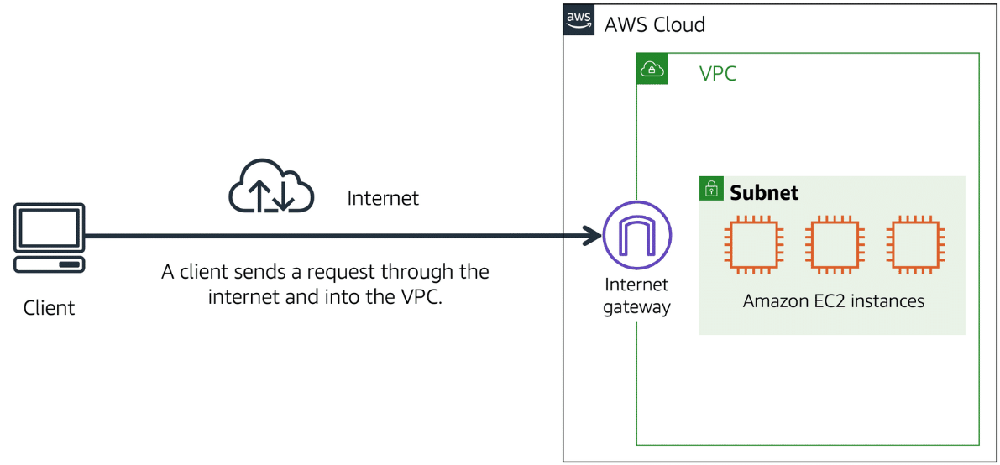
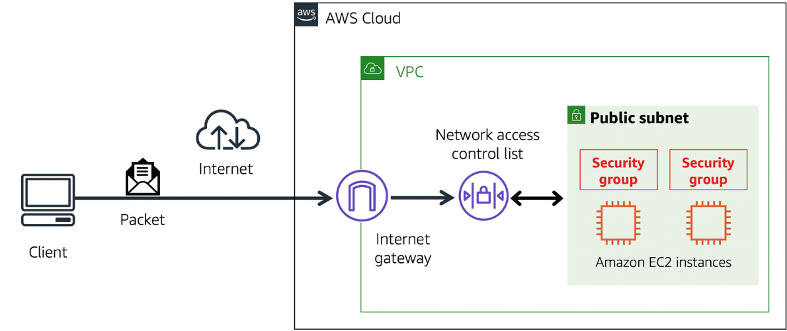

# Amazon Virtual Private Cloud (Amazon VPC)

VPC temel olarak, AWS üzerindeki sana özel bir sanal ağdır.

AWS hizmetlerini kullanan milyonlarca müşteriyi hayal edin. Ayrıca bu müşterilerin oluşturduğu Amazon EC2 instance’ları gibi milyonlarca kaynağı da hayal edin. Eğer tüm bu kaynakların etrafında sınırlar olmasaydı, ağ trafiği hiçbir kısıtlama olmadan bunlar arasında akabilirdi. AWS kaynaklarınızın etrafında sınırlar oluşturmak için kullanabileceğiniz ağ hizmetlerinden biri
Amazon Virtual Private Cloud (Amazon VPC)’dir.

Amazon VPC, AWS Cloud'u içinde izole edilmiş bir bölüm sağlamanıza olanak tanır. Bu izole edilmiş bölüm içinde, kendi tanımladığınız sanal bir ağda kaynaklar başlatabilirsiniz.

Bir virtual private cloud (VPC) içinde, kaynaklarınızı subnet’ler halinde organize edebilirsiniz. Bir subnet, bir VPC’nin bir bölümüdür ve içinde Amazon EC2 instance’ları gibi kaynaklar barındırabilir.

#### NOT: VPC'inizi ister public'e açarsınız isterseniz de private olarak kullanırsınız; size kalmıştır. VPC, sadece gizli bir cloud anlamına gelmez. Onu gizli yapacak öğeler, ne çeşit bir gateway kullandığınız ve ne tür trafiğe izin verdiğinizdir.

## Internet Gateway

VPC'nize, internet üzerinden gelen public trafiğe izin vermek istiyorsanız VPC'ye bir internet gateway (internet geçidi) eklemeniz gerekir. Internet gateway, bir VPC ile internet arasındaki bağlantıdır. 

Bunu, müşterilerin kahve dükkanına girmek için kullandığı bir kapı gibi düşünebilirsiniz.

Bir internet gateway olmadan, hiç kimse VPC’nizin içindeki kaynaklara erişemez.

*Peki ya sadece private kaynakları içeren bir VPC'niz varsa?*

## Virtual Private Gateway

VPC içindeki özel kaynaklara erişmek için, bir virtual private gateway (sanal özel ağ geçidi) kullanabilirsiniz. Bir virtual private gateway’in nasıl çalıştığını şöyle hayal edelim:

İnternet, eviniz ile kahve dükkanı arasındaki yol gibidir. Diyelim ki bu yolda bir korumayla seyahat ediyorsunuz. Yani hâlâ herkesle aynı yolu kullanıyorsunuz, ama ekstra bir koruma katmanıyla. Bu koruma, internet trafiğinizi şifreleyen bir VPN bağlantısı gibidir. Sizi çevredeki diğer isteklerden izole eder ve güvenlik sağlar.

Virtual private gateway, bu şekilde korunan internet trafiğinin VPC’ye girişini sağlayan bileşendir. Ancak, bağlantınız korumalı olsa da trafik sıkışıklığı yaşanabilir, çünkü hâlâ diğer müşterilerle aynı yolu kullanıyorsunuz.

Virtual private gateway, VPC’niz ile özel bir ağ arasında, örneğin bir şirket içi veri merkezi veya kurum içi özel ağ gibi
bir sanal özel ağ (VPN) bağlantısı kurmanıza olanak tanır.

Virtual private gateway, sadece onaylı bir ağdan gelen trafiğe izin vererek bu trafiğin VPC’ye giriş yapmasını sağlar.

## AWS Direct Connect

AWS Direct Connect, veri merkeziniz ile bir VPC arasında özel, dedicated bir bağlantı kurmanızı sağlayan bir hizmettir.

Bunu şöyle düşünebilirsiniz:

Bir apartman binası var ve bu binayı doğrudan kahve dükkanına bağlayan özel bir koridor bulunuyor.
Sadece apartman sakinleri bu koridoru kullanabiliyor.

Bu özel koridor, AWS Direct Connect’in sunduğu adanmış bağlantıyla aynı türden bir bağlantıdır. Apartman sakinleri, genel yolları kullanmak zorunda kalmadan doğrudan kahve dükkanına ulaşabilir.

AWS Direct Connect’in sağladığı özel bağlantı, ağ maliyetlerini düşürmenize ve ağınız üzerinden geçebilecek bant genişliğini artırmanıza yardımcı olur.

Özet olarak, normal VPN bağlantısı şifreli de olsa halka açık altyapıdan yani internetten geçer. İnternet altyapısını kullanmak demek, herkesin kullandığı yolu kullanmak demektir. Dolayısıyla da ağda trafik sıkışıklığı yaşanabilir. Eğer trafiğin sadece sizin data center'ınız ile kuruluşunuz arasında veya sizin kuruluşunuz ile anlaştığınız başka bir kuruluş üzerinden akmasını isterseniz, ayrıca gecikmeyi azaltıp aktarım hızını arttırmak isterseniz, AWS direct connect kullanmanız gerekir. 

AWS direct connect, kuruluşunuzun data center'ı ile kuruluşunuz arasında fiber optik kablolarla yüksek hızda "direkt" bağlantılar sağlar.

Bu işlem şöyle gerçekleşir:

Öncelikle, senin veri merkezinden bir Direct Connect lokasyonuna fiziksel bağlantı gerekir. AWS, bazı fiziksel noktalarda Direct Connect "lokasyonları" kurmuştur. Bu lokasyonlar genelde AWS'in anlaşmalı olduğu diğer kuruluşlardır (Equinix vs.). AWS'in partnerleri tarafından, senin veri merkezinden bu lokasyona kadar fiber bağlantı sağlanır. Bu fiber bağlantı, AWS’in Direct Connect cihazlarına bağlanır. Buradaki cihazlardan da "Virtual Interface (VIF)" adı verilen sanal bağlantı ile senin virtual private gateway'ine ulaşır.

--------------------------------------------------------------------------------------------------------------------------------

## Subnets and Network Access Control Lists

VPC içindeki subnet’lerin rolünü daha iyi anlamak için kahve dükkanı örneğini inceleyelim:

Öncelikle, müşteriler siparişlerini kasiyere verir. Kasiyer de bu siparişleri baristaya iletir. Bu süreç, müşteri sırası büyüdükçe bile düzenli ve verimli bir akış sağlar.

Şimdi diyelim ki bazı müşteriler, kasiyer sırasını atlayıp siparişlerini doğrudan baristaya vermeye çalışıyor.
Bu durum, akışı bozar ee müşterilerin, erişmemesi gereken bir alana (arka tarafa) geçmesine yol açar. Bu örnek, VPC içinde:

Public subnet’lerin (kasiyer) ve Private subnet’lerin (barista) nasıl ayrıldığını ve neden erişim kurallarıyla kontrol edilmesi gerektiğini gösterir.

Bu sorunu çözmek için kahve dükkanının sahipleri, tezgâh alanını bölerek kasiyer ve baristayı ayrı çalışma alanlarına yerleştirir. Kasiyerin alanı müşterilere açık (public facing) olacak şekilde tasarlanır ve sipariş almak için kullanılır. Baristanın alanı ise özel (private) tutulur. Barista hâlâ kasiyerden sipariş alabilir, ama müşteriler doğrudan baristaya erişemez.

Bu durum, AWS ağ servislerini kullanarak kaynakları izole etme ve ağ trafiğinin nasıl akacağını tam olarak belirleme şekline benzer. Kahve dükkanı örneğinde, tezgâh alanını bir VPC gibi düşünebilirsin. Tezgâh alanı, kasiyerin çalışma alanı ve baristanın çalışma alanı olmak üzere iki ayrı bölüme ayrılmıştır.

AWS VPC’de de benzer şekilde, subnet’ler, kaynakları gruplamak için kullanılan ayrı alanlardır. Her subnet, belirli kaynaklara farklı erişim düzeyleri ve ağ trafiği kontrolü sağlar.

> Subnets

Subnet, bir VPC içinde güvenlik veya operasyonel ihtiyaçlara göre kaynakları gruplayabileceğin bir bölümdür. Subnet’ler public (genel) veya private (özel) olabilir.

Public subnet’ler, herkesin erişebilmesi gereken kaynakları barındırır. Örneğin bir e-ticaret sitesinin web sunucusu burada olabilir.

Private subnet’ler ise, yalnızca özel ağ üzerinden erişilmesi gereken kaynakları içerir. Örneğin yine aynı e-ticaret sitesinin, müşteri bilgilerini ve sipariş geçmişini tutan veritabanı.

Bir VPC içinde subnet’ler birbirleriyle iletişim kurabilir. Örneğin, public subnet’teki bir Amazon EC2 instance, private subnet’teki veritabanıyla haberleşebilir.

> Network traffic in a VPC

Bir müşteri, AWS Cloud üzerinde barındırılan bir uygulamadan veri talep ettiğinde, bu istek bir paket (packet) olarak gönderilir. Paket, internet veya ağ üzerinden iletilen veri birimidir. Bu paket, bir internet gateway üzerinden VPC’ye giriş yapar. Ancak bir paket, bir subnet’e girmeden önce ya da bir subnet’ten çıkmadan önce, izinleri kontrol eder. 

Bu izinler, paketin kim tarafından gönderildiğini ve subnet içindeki kaynaklarla nasıl iletişim kurmaya çalıştığını belirtir. Bu izinleri kontrol eden VPC bileşeni, Network Access Control List (ACL) olarak adlandırılır.

### Network ACLs

Network ACL, subnet düzeyinde gelen ve giden trafiği kontrol eden sanal bir firewall'dur. 

Kahve dükkanından çık ve bir havaalanında olduğunu hayal et. Havaalanında yolcular, başka bir ülkeye girmeye çalışıyor.

Burada:

Yolcular = Paketler (packets)

Pasaport kontrol memuru = Network ACL

Pasaport kontrol memuru, hem girişte hem çıkışta yolcuların kimlik bilgilerini kontrol eder.

Eğer yolcu onaylı listede ise → geçişe izin verilir.

Eğer yasaklı listede ise → giriş veya çıkış engellenir.

Her AWS hesabı, varsayılan bir Network ACL ile birlikte gelir. VPC yapılandırırken, varsayılan ACL’yi kullanabilir ya da özel ACL'ler oluşturabilirsin. Varsayılan ACL tüm gelen giden trafiğe izin verirken, custom (özel) ACL'ler tüm gelen giden trafiği engeller (hangi trafiğin girmesine ya da çıkmasına izin verene kadar)

Ayrıca tüm ACL’lerde “explicit deny” (açıkça engelle)” kuralı vardır. Bir paket listede herhangi bir kuralla eşleşmezse, otomatik olarak reddedilir. Yani, x paketi adına listede hiçbir kural belirtilmemişse, default olarak deny edilir.

> Stateless packet filtering

Network ACL’ler, stateless (durumsuz) çalışır. Yani, hiçbir şeyi hatırlamazlar ve subnet sınırından geçen her paketi ayrı ayrı sanki daha önce hiç karşılaşmamışlar gibi denetlerler. Bu, hem giden (outbound) hem de gelen (inbound) paketler için geçerlidir. 

Örneğin, A'dan B'ye bir veri gönderilidğinde ve B'den A'ya bir yanıt döndüğünde, onun bir yanıt olduğunu (yani daha önceden aynı paketle karşılaştığını) bilmezler. Bu yüzden de her paket için tekrar kendi listesini kontrol ederler. Yani "Ben bu paketin geçmesine daha önce izin verdim, o zaman yine vereyim" diye bir şey yapamazlar.

*Bir paket bir subnet’e girdikten sonra, subnet içindeki Amazon EC2 instance’ları gibi kaynaklara erişebilmesi için izinlerinin değerlendirilmesi gerekir. Bir Amazon EC2 instance’ı için paket izinlerini kontrol eden VPC bileşeni,
security group (güvenlik grubu)'dur.*

### Security Groups

Security group, bir Amazon EC2 instance’ı için gelen (inbound) ve giden (outbound) trafiği kontrol eden sanal bir firewall'dur. Varsayılan olarak, bir security group:

- Tüm gelen trafiği reddeder,

- Tüm giden trafiğe izin verir.

Ancak hangi trafiğe izin verileceğini belirlemek için özel kurallar ekleyebilirsin, bu kurallarla eşleşmeyen tüm diğer trafikler reddedilir.

Aynı VPC içinde birden fazla Amazon EC2 instance’ın varsa, bunları aynı security group ile ilişkilendirebilir veya her biri için farklı security group’lar kullanabilirsin. Bu instance'ları ne amaçla kullandığına bağlı olarak değişebilir.

*Dikkat ettiyseniz, security group'ların giden trafiğe izin verdiğinden bahsettik. Bu ACL'lerin yaptığının tam tersidir. Security grouplar, giden trafiğe izin verebiliyorsa, bu trafikten haberdar oldukları anlamına gelir. Bu da bizi "Stateful packet filtering" mantığına götürür.*

> Stateful packet filtering

Security group'lar, stateful (durum bilgili) paket filtreleme gerçekleştirir. Gelen paketler için daha önce verilen kararları hatırlarlar.

Amazon EC2 instance’ından internete bir istek gönderme örneğini tekrar ele alalım. Bu isteğe karşılık gelen yanıt paketi instance’a geri döndüğünde, security group daha önce gönderdiğin isteği hatırlar. Inbound security group kurallarından bağımsız olarak, security group yanıtın geçmesine izin verir.

Yani aslında, eğer bir bağlantı senin instance'ından başlatıldıysa, gelen yanıt paketleri, inbound kurallarından etkilenmez. Örneğin, senin instance'ından çıkan bir pakete yanıt geldiğini varsayalım. Inbound kurallarında "bu porta izin verme" dense bile, o paket senin instance'ından çıkan bir paketin yanıtı olduğu için, her harükarda izin verilir. Ama yine aynı porttan bir paket gelir ve o paket bu sefer senin gönderdiğin bir pakete yanıt değilse, o zaman reddedilir.

*Hem network ACL’ler hem de security group’lar ile, VPC’nizdeki ağ trafiği için özel kurallar yapılandırabilirsiniz.*

-------------------------------------------------------------------------------------------------------------------------------

## Global Networking

### Amazon Route 53

Amazon Route 53, bir DNS web servisidir. Geliştiricilere ve işletmelere, AWS üzerinde barındırılan internet uygulamalarına son kullanıcıları yönlendirmek için güvenilir bir yöntem sunar.

Amazon Route 53, kullanıcı isteklerini AWS üzerinde çalışan altyapıya (örneğin Amazon EC2 instance'ları ve yük dengeleyiciler gibi) bağlar. Ayrıca, AWS dışındaki altyapılara da kullanıcı yönlendirmesi yapabilir.

Route 53’ün bir diğer özelliği ise alan adlarına ait DNS kayıtlarını yönetme yeteneğidir. Route 53 üzerinden doğrudan yeni alan adları kaydedebilirsin. Ayrıca, başka alan adı kayıt şirketleri tarafından yönetilen mevcut alan adlarının DNS kayıtlarını da Route 53’e aktarabilirsin. Bu sayede tüm alan adlarını tek bir yerden yönetebilirsin.

Bundan önce, bir content delivery service olan Amazon CloudFront'u öğrenmiştik. Aşağıdaki örnek, Route 53 ile Amazon CloudFront’un birlikte nasıl çalışarak içeriği müşterilere ulaştırdığını açıklar.

> ÖRNEK

Diyelim ki AnyCompany’nin uygulaması birkaç Amazon EC2 instance’ı üzerinde çalışıyor. Bu instance’lar, bir Application Load Balancer’a bağlı olan bir Auto Scaling grubunun içinde yer alıyor.

1- Bir müşteri, AnyCompany’nin web sitesine girerek uygulamadan veri talep eder.

2- Amazon Route 53, DNS çözümlemesini kullanarak AnyCompany.com alan adının karşılık geldiği IP adresi olan 192.0.2.0’ı belirler. Bu bilgi müşteriye geri gönderilir.

3- Müşterinin isteği, Amazon CloudFront aracılığıyla en yakın edge (uç) konumuna gönderilir.

4- Amazon CloudFront, Application Load Balancer’a bağlanır ve gelen paketi bir Amazon EC2 instance’ına iletir.

#### NOT: CloudFront bildiğiniz gibi normalde içeriklerin kopyasını tutar ve direk o kopyadan size sunar. Ama bu örnekte de olduğu gibi, bir kullanıcı ilk kez içerik isterse veya içerik önbellekten silinmişse, CloudFront o isteği origin'e (yani kökenine) yönlendirecektir.

