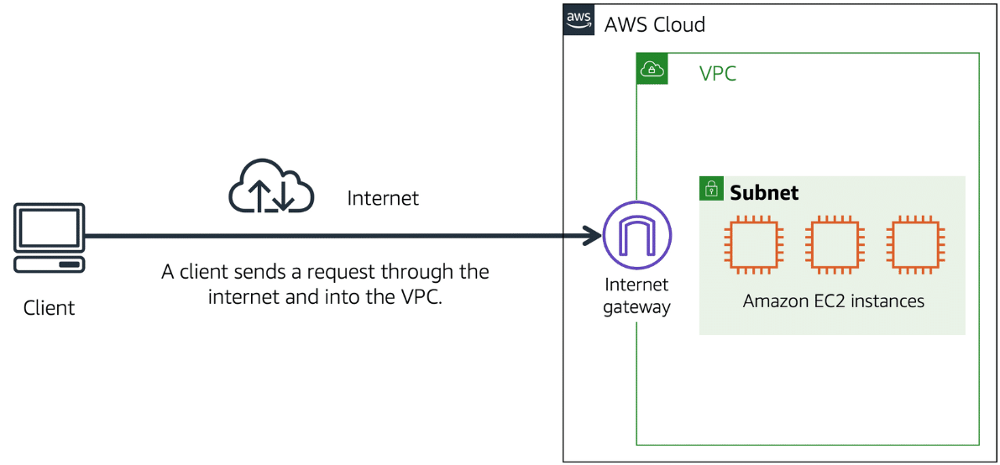
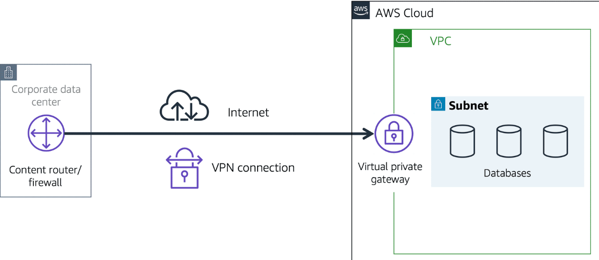
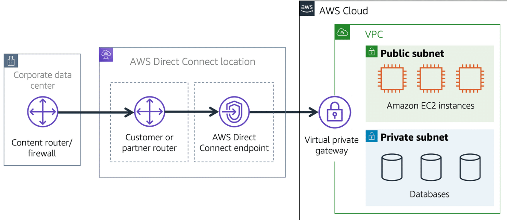

# Amazon Virtual Private Cloud (Amazon VPC)

VPC temel olarak, AWS üzerindeki sana özel bir sanal ağdır.

AWS hizmetlerini kullanan milyonlarca müşteriyi hayal edin. Ayrıca bu müşterilerin oluşturduğu Amazon EC2 instance’ları gibi milyonlarca kaynağı da hayal edin. Eğer tüm bu kaynakların etrafında sınırlar olmasaydı, ağ trafiği hiçbir kısıtlama olmadan bunlar arasında akabilirdi. AWS kaynaklarınızın etrafında sınırlar oluşturmak için kullanabileceğiniz ağ hizmetlerinden biri
Amazon Virtual Private Cloud (Amazon VPC)’dir.

Amazon VPC, AWS Cloud'u içinde izole edilmiş bir bölüm sağlamanıza olanak tanır. Bu izole edilmiş bölüm içinde, kendi tanımladığınız sanal bir ağda kaynaklar başlatabilirsiniz.

Bir virtual private cloud (VPC) içinde, kaynaklarınızı subnet’ler halinde organize edebilirsiniz. Bir subnet, bir VPC’nin bir bölümüdür ve içinde Amazon EC2 instance’ları gibi kaynaklar barındırabilir.

#### NOT: VPC'inizi ister public'e açarsınız isterseniz de private olarak kullanırsınız; size kalmıştır. VPC, sadece gizli bir cloud anlamına gelmez. Onu gizli yapacak öğeler, ne çeşit bir gateway kullandığınız ve ne tür trafiğe izin verdiğinizdir.

## Internet Gateway

VPC'nize, internet üzerinden gelen public trafiğe izin vermek istiyorsanız VPC'ye bir internet gateway (internet geçidi) eklemeniz gerekir. Internet gateway, bir VPC ile internet arasındaki bağlantıdır. 

Bunu, müşterilerin kahve dükkanına girmek için kullandığı bir kapı gibi düşünebilirsiniz.

Bir internet gateway olmadan, hiç kimse VPC’nizin içindeki kaynaklara erişemez.

*Peki ya sadece private kaynakları içeren bir VPC'niz varsa?*

## Virtual Private Gateway

VPC içindeki özel kaynaklara erişmek için, bir virtual private gateway (sanal özel ağ geçidi) kullanabilirsiniz. Bir virtual private gateway’in nasıl çalıştığını şöyle hayal edelim:

İnternet, eviniz ile kahve dükkanı arasındaki yol gibidir. Diyelim ki bu yolda bir korumayla seyahat ediyorsunuz. Yani hâlâ herkesle aynı yolu kullanıyorsunuz, ama ekstra bir koruma katmanıyla. Bu koruma, internet trafiğinizi şifreleyen bir VPN bağlantısı gibidir. Sizi çevredeki diğer isteklerden izole eder ve güvenlik sağlar.

Virtual private gateway, bu şekilde korunan internet trafiğinin VPC’ye girişini sağlayan bileşendir. Ancak, bağlantınız korumalı olsa da trafik sıkışıklığı yaşanabilir, çünkü hâlâ diğer müşterilerle aynı yolu kullanıyorsunuz.

Virtual private gateway, VPC’niz ile özel bir ağ arasında, örneğin bir şirket içi veri merkezi veya kurum içi özel ağ gibi
bir sanal özel ağ (VPN) bağlantısı kurmanıza olanak tanır.

Virtual private gateway, sadece onaylı bir ağdan gelen trafiğe izin vererek bu trafiğin VPC’ye giriş yapmasını sağlar.

## AWS Direct Connect

AWS Direct Connect, veri merkeziniz ile bir VPC arasında özel, dedicated bir bağlantı kurmanızı sağlayan bir hizmettir.

Bunu şöyle düşünebilirsiniz:

Bir apartman binası var ve bu binayı doğrudan kahve dükkanına bağlayan özel bir koridor bulunuyor.
Sadece apartman sakinleri bu koridoru kullanabiliyor.

Bu özel koridor, AWS Direct Connect’in sunduğu adanmış bağlantıyla aynı türden bir bağlantıdır. Apartman sakinleri, genel yolları kullanmak zorunda kalmadan doğrudan kahve dükkanına ulaşabilir.

AWS Direct Connect’in sağladığı özel bağlantı, ağ maliyetlerini düşürmenize ve ağınız üzerinden geçebilecek bant genişliğini artırmanıza yardımcı olur.

Özet olarak, normal VPN bağlantısı şifreli de olsa halka açık altyapıdan yani internetten geçer. İnternet altyapısını kullanmak demek, herkesin kullandığı yolu kullanmak demektir. Dolayısıyla da ağda trafik sıkışıklığı yaşanabilir. Eğer trafiğin sadece sizin data center'ınız ile kuruluşunuz arasında veya sizin kuruluşunuz ile anlaştığınız başka bir kuruluş üzerinden akmasını isterseniz, ayrıca gecikmeyi azaltıp aktarım hızını arttırmak isterseniz, AWS direct connect kullanmanız gerekir. 

AWS direct connect, kuruluşunuzun data center'ı ile kuruluşunuz arasında fiber optik kablolarla yüksek hızda "direkt" bağlantılar sağlar.

Bu işlem şöyle gerçekleşir:

Öncelikle, senin veri merkezinden bir Direct Connect lokasyonuna fiziksel bağlantı gerekir. AWS, bazı fiziksel noktalarda Direct Connect "lokasyonları" kurmuştur. Bu lokasyonlar genelde AWS'in anlaşmalı olduğu diğer kuruluşlardır (Equinix vs.). AWS'in partnerleri tarafından, senin veri merkezinden bu lokasyona kadar fiber bağlantı sağlanır. Bu fiber bağlantı, AWS’in Direct Connect cihazlarına bağlanır. Buradaki cihazlardan da "Virtual Interface (VIF)" adı verilen sanal bağlantı ile senin virtual private gateway'ine ulaşır.

