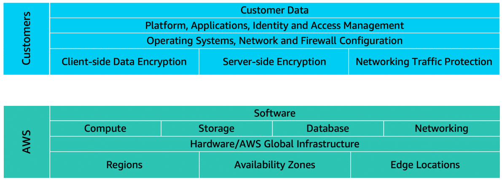

# AWS Shared Responsibility Model

Bu zamana kadar AWS Cloud'unda oluşturabileceğin çeşitli kaynakları öğrendin. Bu kaynaklara Amazon EC2 instance’ları, Amazon S3 bucket’ları ve Amazon RDS veritabanları dahildir. Peki bu kaynakların güvenliğinden kim sorumludur: sen mi (müşteri) yoksa AWS mi?

Aslında iki taraf da sorumludur. Çünkü AWS ortamını tek bir bütün gibi değil, birbiri üzerine kurulu parçalardan oluşan bir sistem gibi ele alırsın. Bu parçaların bazıları AWS’nin, bazıları da senin sorumluluğundadır. Bu kavram, paylaşılan sorumluluk modeli (shared responsibility model) olarak adlandırılır. 

Müşteri sorumlulukları → “buluttaki güvenlik (security in the cloud)”

AWS sorumlulukları → “bulutun güvenliği (security of the cloud)”

Bu modeli, bir ev sahibi ile ev inşa eden kişi arasındaki sorumlulukların bölünmesine benzetebilirsin.

İnşaatçı (AWS), evi inşa etmekten ve yapının sağlam olmasını sağlamaktan sorumludur.

Ev sahibi (yani müşteri) ise, evin içindekileri korumaktan; yani kapıların kapalı ve kilitli olduğundan emin olmaktan sorumludur.

> Security in the cloud

Müşteriler, AWS Bulutu'nda oluşturdukları ve yerleştirdikleri her şeyin güvenliğinden sorumludur.

AWS hizmetlerini kullanırken, içeriğin üzerinde tam kontrol sende olur. Hangi içeriği AWS üzerinde saklayacağın, hangi AWS hizmetlerini kullanacağın ve bu içeriğe kimin erişeceği gibi güvenlik gereksinimlerinin yönetimi sana aittir. Erişim haklarının nasıl verileceğini, yönetileceğini ve iptal edileceğini de sen belirlersin.

Aldığın güvenlik önlemleri; kullandığın hizmetlere, sistemlerinin karmaşıklığına ve şirketinin operasyonel ve güvenlik ihtiyaçlarına göre değişir.

Bu önlemlere örnek olarak:

- Amazon EC2 instance’larında çalışacak işletim sistemlerinin seçilmesi, yapılandırılması ve yamalanması,

- Güvenlik gruplarının (security groups) yapılandırılması,

- Kullanıcı hesaplarının yönetilmesi verilebilir.

> Security of the cloud

AWS, altyapının tüm katmanlarındaki bileşenleri işletir, yönetir ve kontrol eder. Buna, hizmetlerin çalıştığı veri merkezlerinin fiziksel güvenliği, host işletim sistemi, sanallaştırma katmanı gibi alanlar dahildir.

AWS, AWS Bulutu'nda sunulan tüm hizmetleri çalıştıran global infrastructure korunmasından sorumludur. Bu altyapı; AWS Region’ları, Availability Zone’lar ve uç noktaları (edge locations) içerir.

AWS, kaynaklarının barındırıldığı fiziksel altyapının güvenliğini yönetir. Bu altyapıya şunlar dahildir:

- Physical security of data centers
  
- Hardware and software infrastructure

- Network infrastructure

- Virtualization infrastructure

AWS veri merkezlerini doğrudan ziyaret edemesen de, AWS çeşitli bağımsız denetçi raporları sunar. Bu denetçiler, AWS’nin birçok bilgi güvenliği standardı ve düzenlemesine uyduğunu doğrulamıştır.

# User Permissions and Access

## AWS Identity and Access Management (IAM)

AWS IAM, bir authentication ve authorization hizmetidir. AWS Identity and Access Management (IAM), AWS hizmetlerine ve kaynaklarına güvenli bir şekilde erişimi yönetmenizi sağlar. IAM, şirketinizin özel operasyonel ve güvenlik ihtiyaçlarına göre erişimi yapılandırma esnekliği sunar. IAM şu özellikleri sunar:

- IAM kullanıcıları, grupları ve roller

- IAM politikaları

- Multi-factor Authentication (MFA)

### AWS account root user

AWS hesabınızı ilk oluşturduğunuzda, root user (kök kullanıcı) olarak bilinen bir kimlikle başlarsınız.

Root user, AWS hesabınızı oluştururken kullandığınız e-posta adresi ve parolayla oturum açarak erişilir. Root user’ı, bir kahve dükkanının sahibi gibi düşünebilirsiniz. Hesaptaki tüm AWS services (AWS hizmetleri) ve resources (kaynaklar) üzerinde tam erişime sahiptir.

*Best practice olarak, Root user’ı günlük görevler için kullanmanız önerilmez. Bunun yerine, root user ile ilk IAM user’ınızı oluşturun ve bu kullanıcıya diğer kullanıcıları oluşturma yetkisi verin. Root user’ı yalnızca, sadece root user’a özel olan sınırlı sayıdaki görevi yerine getirmeniz gerektiğinde kullanın.*

### IAM users

Bir IAM user, AWS'te sizin oluşturduğunuz bir kimliktir. AWS hizmetleri ve kaynaklarıyla etkileşime giren kişiyi ya da uygulamayı temsil eder. Bir adı (name) ve kimlik bilgileri (credentials) vardır.

Varsayılan olarak, AWS’te yeni bir IAM user oluşturduğunuzda, bu kullanıcıya hiçbir permission (izin) tanımlı değildir. Bu IAM user’ın AWS üzerinde belirli işlemleri yapabilmesi için — örneğin bir Amazon EC2 instance başlatmak ya da bir Amazon S3 bucket oluşturmak gibi — gerekli izinleri (permissions) vermeniz gerekir.

*Best practice olarak, AWS’e erişmesi gereken her kişi için ayrı IAM user oluşturulması önerilir.*

*Aynı erişim düzeyine ihtiyaç duyan birden fazla çalışanınız olsa bile, her biri için ayrı IAM user oluşturmalısınız. Bu yaklaşım, her IAM user’ın kendine özgü security credentials (güvenlik kimlik bilgileri) olmasını sağlayarak ek güvenlik sunar.*

### IAM policies

Bir IAM policy, çeşitli AWS hizmetlerine ve kaynaklarına izin veren (allow) veya bunları reddeden (deny) bir belgedir.

IAM policies, kullanıcıların kaynaklara erişim düzeylerini özelleştirmenizi sağlar. Örneğin, kullanıcıların AWS hesabınızdaki tüm Amazon S3 buckets’lara erişmesine izin verebilir ya da yalnızca belirli bir bucket’a erişim izni tanıyabilirsiniz.

*Best practice olarak, izin (permission) verirken en az ayrıcalık (least privilege) güvenlik ilkesini takip edin. Bu ilkeyi uygulayarak, kullanıcıların veya rollerin görevlerini yerine getirmek için gerekenden fazla permission (izin) almasını önlemiş olursunuz.*

*Örneğin, bir çalışanın yalnızca belirli bir Amazon S3 bucket’a erişmesi gerekiyorsa, IAM policy içinde sadece o bucket’a izin tanımlayın. Çalışana AWS hesabınızdaki tüm bucket’lara erişim vermek yerine bu şekilde daha güvenli bir erişim kontrolü sağlamış olursunuz.*

> IAM policy örneği:

İşte IAM policies’in nasıl çalıştığını gösteren bir örnek: Diyelim ki kahve dükkanı sahibi, yeni işe alınan bir kasiyer için bir IAM user oluşturmak zorunda. Kasiyerin, Amazon S3 üzerinde tutulan ve kimliği AWSDOC-EXAMPLE-BUCKET olan bir bucket’taki fişlere erişmesi gerekiyor.

Bu örnekte, IAM policy belirli bir Amazon S3 işlemi olan "ListObject" eylemine izin veriyor. Policy aynı zamanda belirli bir bucket ID’si olan AWSDOC-EXAMPLE-BUCKET’ı da içeriyor.

Kahve dükkanı sahibi, bu policy’yi kasiyerin IAM user’ına eklediğinde, kasiyer AWSDOC-EXAMPLE-BUCKET içindeki tüm nesneleri (objects) görüntüleyebilecek.

Eğer dükkan sahibi, kasiyerin başka AWS hizmetlerine de erişmesini veya farklı işlemler gerçekleştirmesini istiyorsa, bu hizmetleri ve işlemleri belirten ek policies de tanımlayıp kullanıcısına eklemelidir.

### IAM Groups

Şimdi, diyelim ki kahve dükkanı birkaç yeni kasiyer daha işe aldı. Her bir IAM user için ayrı ayrı izin atamak yerine, sahip bu kullanıcıları bir IAM group içine yerleştirir. Bu yöntemle, sahip aynı permissions’ları (izinleri) tek seferde gruba uygulayarak, gruptaki tüm kullanıcıların bu izinleri otomatik olarak almasını sağlar. Böylece yönetim daha kolay ve tutarlı hale gelir.

İzinleri grup düzeyinde atamak, bir çalışanın farklı bir göreve geçmesi durumunda da izin yönetimini kolaylaştırır. Örneğin, bir kasiyer Inventory Specialist (Envanter Uzmanı) olduğunda, sahip bu kullanıcıyı “Cashiers” grubundan çıkarır ve “Inventory Specialists” grubuna ekler. Böylece çalışanlar yalnızca mevcut rollerine uygun izinlere sahip olur.

*Peki ya bir çalışan kalıcı olarak görev değiştirmemişse, fakat gün içinde farklı iş istasyonları arasında rotasyona giriyorsa? Bu durumda, ihtiyaç duyduğu erişimi IAM roles (roller) aracılığıyla alabilir.*

### IAM Roles

Kahve dükkanında bir çalışan gün içinde farklı iş istasyonları arasında rotasyon yapar. Dükkanın o anki personel durumuna göre bu çalışan birden fazla görevi yerine getirebilir: kasada çalışmak, envanter sistemini güncellemek, çevrimiçi siparişleri işlemek vb.

Çalışan farklı bir göreve geçtiğinde, bir iş istasyonuna olan erişimini bırakır ve bir sonraki iş istasyonuna erişim kazanır. Çalışan bu geçişleri kolayca yapabilir, ancak herhangi bir anda yalnızca tek bir iş istasyonuna erişimi olabilir. Bu kavram, AWS’te IAM roles (roller) ile aynı şekilde uygulanır.

Bir IAM role, geçici erişim izinleri kazanmak için assume (üstlenilebilen) bir kimliktir.

Bir IAM user, uygulama ya da hizmet bir IAM rolünü üstlenmeden önce, bu role geçiş yapmak için gerekli permissions’lara sahip olmalıdır. Bir kişi bir IAM rolünü assume ettiğinde, önceki rolündeki tüm izinleri bırakır ve yeni rolün izinlerini devralır.

*Best practice olarak, IAM roles, bir hizmete veya kaynağa geçici erişim sağlanması gereken durumlar için idealdir. Uzun vadeli erişim yerine, kısa süreli ve göreve özel erişim gerektiğinde IAM rolleri kullanılmalıdır.*

#### NOT: IAM roles, yukarıda da bahsettiğimiz gibi, sadece bir user'a değil; uygulama ya da hizmete de atanabilir.

## Multi-factor authentication (MFA)

IAM içinde, MFA, AWS hesabınıza ek bir güvenlik katmanı sağlar. MFA şu şekilde çalışır:

1- Öncelikle kullanıcı, AWS web sitesinde oturum açmak için IAM kullanıcı kimliğini ve parolasını girer.

2- Sonraki adımda, kullanıcıdan AWS MFA cihazı üzerinden bir doğrulama yanıtı (authentication response) girmesi istenir. Bu cihaz;

- hardware security key

- hardware device

- telefon gibi bir cihazda bulunan MFA App'i olabilir.

-------------------------------------------------------------------------------------------------------------------------------

## AWS Organizations

Diyelim ki şirketinizin birden fazla AWS hesabı var. Bu hesapları merkezi bir yerden birleştirmek ve yönetmek için AWS Organizations hizmetini kullanabilirsiniz.

Bir organization oluşturduğunuzda, AWS Organizations otomatik olarak bir root (tüm hesapların üst kapsayıcısı) oluşturur.

AWS Organizations içinde, organizasyonunuzdaki hesaplara ait izinleri merkezi olarak kontrol etmek için service control policies (SCPs) kullanabilirsiniz. SCP’ler, her bir hesaptaki kullanıcıların ve rollerin erişebileceği AWS hizmetleri, kaynaklar ve bireysel API işlemleri üzerinde kısıtlamalar getirmenizi sağlar.

> Organizational units

AWS Organizations içinde, benzer iş veya güvenlik gereksinimlerine sahip hesapları daha kolay yönetebilmek için bu hesapları organizational unit (OU) adı verilen gruplar altında toplayabilirsiniz.

Bir OU’ya bir politika (policy) uyguladığınızda, o OU içindeki tüm hesaplar bu policy’de belirtilen izinleri otomatik olarak devralır.

Ayrı hesapları OU’lara göre düzenlemek, özellikle özel güvenlik gereksinimleri olan iş yüklerini veya uygulamaları izole etmek açısından oldukça kullanışlıdır.

Örneğin, şirketinizde yalnızca belirli regülasyonlara (örneğin sağlık ya da finans gibi) uygun AWS hizmetlerine erişmesi gereken hesaplar varsa, bu hesapları tek bir OU altında toplayabilirsiniz. Sonrasında bu OU’ya, regülasyonlara uymayan tüm AWS hizmetlerine erişimi engelleyen bir policy ekleyebilirsiniz.

#### NOT: Hesapları, kullanıcılarla karıştırmamak gerekir. Her hesabın bir root user'ı vardır ve bu hesabın içinde IAM User'lar tanımlanabilir. AWS Organizations, kullanıcıları değil daha genel olarak hesapları organize etmenize olanak tanır. Bu yüzden, IAM Policy; IAM user, group, role için uygulanabilirken, OU, accounts ve root için uygulamayazsınız. Onlar için SCP uygulanabilir. Yani accountlar, kullanıcılara göre daha geniş bir kümedir diyebiliriz.

## Compliance

### AWS Artifact

AWS Artifact, şirketinizin faaliyet gösterdiği sektöre bağlı olarak, belirli standartları karşılaması gereken durumlarda devreye girer. Bir denetim veya inceleme, şirketin bu standartları karşılayıp karşılamadığını garanti altına alır.

AWS Artifact, AWS security ve compliance raporlarına ve belirli çevrimiçi sözleşmelere isteğe bağlı erişim sağlayan bir hizmettir. AWS Artifact iki ana bölümden oluşur: AWS Artifact Agreements ve AWS Artifact Reports.
 
Diyelim ki şirketinizin, AWS hizmetleri boyunca belirli bilgi türlerinin kullanımıyla ilgili olarak AWS ile bir sözleşme imzalaması gerekiyor. Bunu "AWS Artifact Agreements" üzerinden gerçekleştirebilirsiniz.

AWS Artifact Agreements bölümünde, bireysel bir hesap için ve AWS Organizations içindeki tüm hesaplar için sözleşmeleri inceleyebilir, kabul edebilir ve yönetebilirsiniz.
Farklı düzenlemelere tabi olan müşterilerin ihtiyaçlarını karşılamak için çeşitli sözleşme türleri sunulur; örneğin Health Insurance Portability and Accountability Act (HIPAA) gibi düzenlemelere tabi olanlar için.

Şirketinizin geliştirme ekibinden bir üyenin bir uygulama geliştirdiğini ve belirli düzenleyici standartlara uyum konusundaki sorumluluğu hakkında daha fazla bilgiye ihtiyaç duyduğunu varsayalım. Bu kişiye bu bilgilere "AWS Artifact Reports" üzerinden erişmesini tavsiye edebilirsiniz.

AWS Artifact Reports, üçüncü taraf denetçiler (auditors) tarafından hazırlanmış compliance raporlarını sunar. Bu denetçiler, AWS’nin küresel, bölgesel ve sektöre özel çeşitli güvenlik standartlarına ve düzenlemelere uygunluğunu test edip doğrulamışlardır. AWS Artifact Reports, en son yayımlanan raporlarla güncel kalır.

Bu AWS denetim belgelerini, AWS’nin güvenlik kontrollerine kanıt olarak denetçilerinize veya düzenleyici kurumlara sunabilirsiniz.

AWS Artifact, AWS güvenlik ve uyumluluk (compliance) belgelerine erişim sağlar; bu belgeler arasında AWS ISO sertifikaları, Payment Card Industry (PCI) raporları ve Service Organization Control (SOC) raporları gibi belgeler yer alır.

> Customer Compliance Center

Bu merkezde, düzenlemelere tabi sektörlerdeki şirketlerin uyumluluk (compliance), yönetişim (governance) ve denetim (audit) zorluklarını nasıl çözdüğünü gösteren müşteri uyumluluk hikayelerini okuyabilirsiniz. Ayrıca aşağıdaki konularla ilgili whitepaper'lara ve dökümantasyonlara erişebilirsiniz:

- AWS’nin temel uyumluluk sorularına verdiği yanıtlar

- AWS risk ve uyumluluk genel bakışı

- Güvenlik denetimi kontrol listesi

Buna ek olarak, Customer Compliance Center, auditor learning path adlı bir öğrenim yolunu da içerir. Bu yol, denetim, uyumluluk ve hukuk gibi alanlarda çalışan kişilere yöneliktir ve AWS Cloud ortamında iç operasyonların uyumluluğu nasıl gösterebileceğini öğretmeyi amaçlar.

## Denial-of-Service Attacks (DoS, DDoS)

DoS veya DDoS saldırıların çoğu sadece sizin EC2 instance'ınıza özel değil, aynı zamanda AWS'in ağına yapılan bir saldırı olduğundan, AWS'in devasa altyapısı bir çok saldırıyı zaten devre dışı bırakabilecek kapasitededir. Bu büyük altyapıya rağmen teorik olarak bu sistemleri de overwhelm etmek mümkün olsa da, sizin bireysel savunmanıza göre çok daha zordur.

AWS, ELB sayesinde de bir takım DDoS saldırılarını önleyebilir. ELB'nin çalışma mantığına göre, istekler sizin instance'ınıza gelmeden önce ELB'den geçer ve bu yapı da buna benzer durumlarda bir nevi ek güvenlik katmanı sağlar.

Ayrıca security grouplar sayesinde sadece belirli yerlerden gelen trafiğe izin vererek DDoS saldırılarının bir kısmını önleyebilirsiniz.

Hepsine ek olarak, DoS ve DDoS saldırılarının uygulamalarınız üzerindeki etkisini azaltmak için, AWS Shield hizmetinden faydalanabilirsiniz. AWS Shield iki seçenekle karşınıza çıkar:

- AWS Shield Standard:

AWS müşterilerini ücretsiz olarak otomatik şekilde korur. Bu hizmet, AWS kaynaklarınızı en yaygın ve sık gerçekleşen DDoS saldırısı türlerine karşı korur.

Uygulamalarınıza gelen ağ trafiği incelenirken, AWS Shield Standard, çeşitli analiz teknikleri kullanarak kötü niyetli trafiği gerçek zamanlı olarak tespit eder ve bu trafiği otomatik olarak engeller (mitigate eder yani hafifletir).

- AWS Shield Advanced:

ücretli bir hizmettir ve karmaşık DDoS saldırılarını tespit edip mitigate etme ile ayrıca ayrıntılı saldırı teşhisi imkânı sunar. Bu hizmet, Amazon CloudFront, Amazon Route 53 ve Elastic Load Balancing gibi diğer AWS servisleriyle entegre çalışır. Ayrıca, AWS WAF (Web Application Firewall) ile entegre ederek, özel kurallar yazarak daha gelişmiş ve hedeflenmiş DDoS saldırılarını önleyebilirsiniz.

# Additional Security Services

## AWS Key Management Service (AWS KMS)

Uygulamalarınıza ait verilerin hem depolanırken (encryption at rest) hem de iletilirken (encryption in transit) güvenli olmasını sağlamalısınız.

AWS Key Management Service (AWS KMS), şifreleme işlemlerini gerçekleştirmek için kriptografik anahtarlar kullanmanızı sağlar. Kriptografik anahtar, veriyi kilitlemek (şifrelemek) ve açmak (şifresini çözmek) için kullanılan rastgele sayılardan oluşan bir dizidir. AWS KMS ile:

- Kriptografik anahtarlar oluşturabilir, yönetebilir ve kullanabilirsiniz.

- Anahtarların kimin tarafından ve ne zaman kullanılabileceğini belirleyebilirsiniz. Örneğin, belirli IAM kullanıcıları veya rollerin anahtarları yönetebilmesini sağlayabilir, gerekirse anahtarları geçici olarak devre dışı bırakabilirsiniz.

Anahtarlarınız AWS KMS dışına asla çıkmaz, yani kontrol daima sizdedir.

## AWS WAF (Web Application Firewall)

AWS WAF, web uygulamalarınıza gelen ağ isteklerini izlemenizi sağlayan bir web uygulama güvenlik duvarıdır.

AWS WAF, Amazon CloudFront ve Application Load Balancer ile birlikte çalışır. Daha önce öğrendiğiniz network ACL'lere benzer şekilde çalışır; ancak burada kullanılan yapı, web ACL (web access control list) adı verilen özel bir listedir ve AWS kaynaklarınızı korumak için kullanılır.

> How does AWS WAF work?

Diyelim ki uygulamanıza zararlı (malicious) ağ istekleri gönderen birkaç IP adresi var. Bu kötü niyetli istekleri engellemek istiyor ama aynı zamanda gerçek kullanıcıların uygulamaya erişmesini sürdürmesini istiyorsunuz. Bu durumda web ACL yapılandırılır ve tüm isteklere izin verilir, yalnızca belirttiğiniz IP adreslerinden gelenler engellenir.

AWS WAF ayrıca; SQL injection, Cross-site scripting (XSS) gibi yaygın saldırı türlerine karşı da koruma sağlayabilir.

## Amazon Inspector

Diyelim ki kahve dükkanındaki geliştiriciler yeni bir sipariş uygulaması üzerinde çalışıyor ve bu uygulamanın security best practices uygun şekilde geliştirildiğinden emin olmak istiyorlar. Ancak, geliştirmeleri gereken başka uygulamalar da olduğundan, manuel güvenlik testlerine zaman ayıramıyorlar. Bu yüzden otomatik güvenlik değerlendirmeleri yapmak için Amazon Inspector kullanmaya karar veriyorlar.

Amazon Inspector, uygulamalarınızın güvenliğini ve uyumluluğunu geliştirmek için otomatik güvenlik değerlendirmeleri yapar. Şunları kontrol eder:

- Güvenlik açıkları,

- Security best practices uygulamalarından sapmalar. Örneğin, Amazon EC2 örneklerine açık erişim veya güvenlik zafiyeti içeren yazılım sürümlerinin kurulumu.

Değerlendirme tamamlandığında, Amazon Inspector size bir güvenlik bulguları listesi sunar:

- Bulgular önem derecesine göre sıralanır (low, medium, high, critical)

- Her sorun için ayrıntılı açıklama ve çözüm önerisi yer alır

AWS bu önerilerin tüm güvenlik risklerini tamamen ortadan kaldıracağını garanti etmez. Çünkü shared responsibility model kapsamında, uygulamalarınızın, süreçlerinizin ve araçlarınızın güvenliğinden siz sorumlusunuz.

## Amazon GuardDuty

Amazon GuardDuty, AWS altyapınız ve kaynaklarınız için akıllı tehdit tespiti sağlayan bir hizmettir. Bu hizmet, AWS ortamınızdaki ağ trafiğini ve hesap davranışlarını sürekli izleyerek olası tehditleri tespit eder.

GuardDuty’yi AWS hesabınız için etkinleştirdikten sonra, GuardDuty ağ ve hesap etkinliklerinizi otomatik olarak izlemeye başlar. Ekstra bir güvenlik yazılımı kurmanıza veya yönetmenize gerek yoktur.

GuardDuty daha sonra VPC Flow Logs ve DNS logları dahil olmak üzere birden fazla AWS kaynağından gelen verileri sürekli olarak analiz eder. GuardDuty herhangi bir tehdit tespit ederse, AWS Management Console üzerinden bu tehditlere dair ayrıntılı bulguları inceleyebilirsiniz. Bulgular, giderme için önerilen adımları içerir. Ayrıca, GuardDuty’nin güvenlik bulgularına yanıt olarak otomatik giderme adımları gerçekleştirmesi için AWS Lambda fonksiyonları da yapılandırabilirsiniz.
